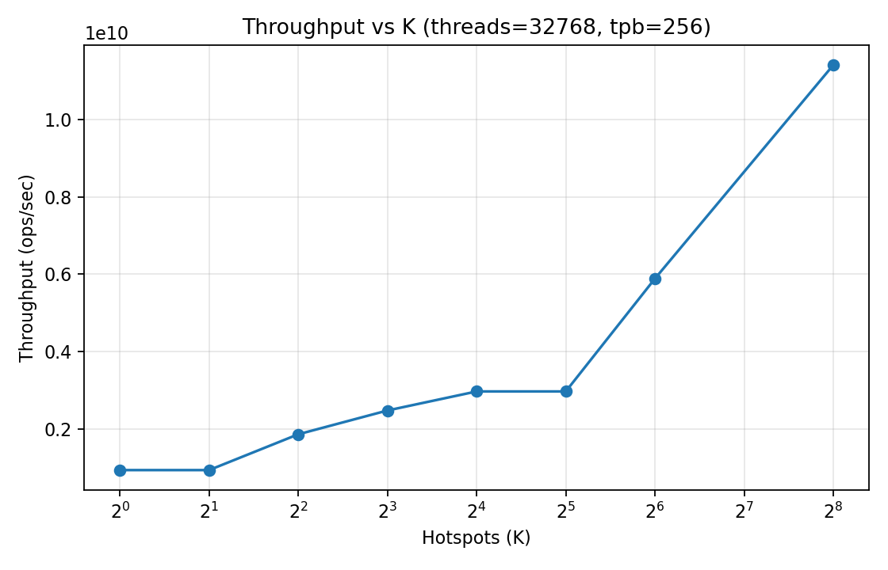
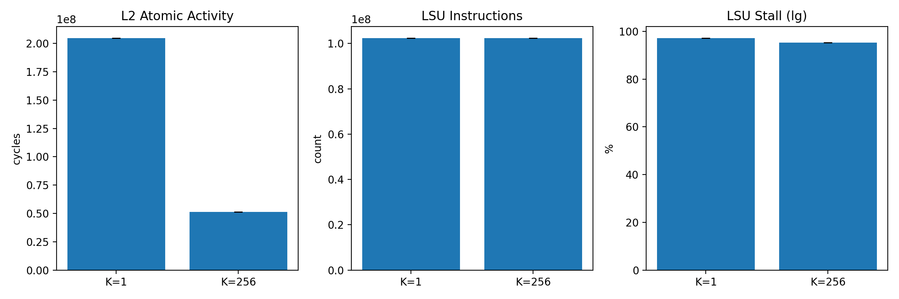
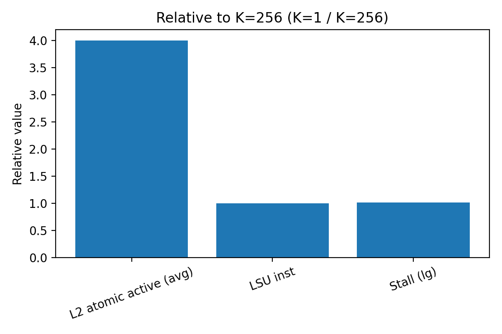

# Atomic Contention on GPUs: From Throughput Saturation to Design Implications

A CUDA microbenchmark and profiling study showing that GPU atomic contention leads to throughput saturation due to serialization, not memory bandwidth or compute.

---

## Overview

This repository investigates the scalability limits of atomic operations on GPUs (NVIDIA RTX A2000).

Key findings:

- Not compute-bound (instruction count is constant)
- Not memory-bandwidth-bound (DRAM usage ~0)
- Throughput-limited by atomic serialization

---

## Repository Structure

### CUDA Kernels

- `src/atomic_stress.cu`  
  Basic version of the benchmark (reference implementation)

- `src/atomic_stress_v3.cu`  
  Intermediate version used during experimentation

- `src/atomic_stress_v4.cu`  
  Final version used for all profiling and reported results

All results in this repository are generated using **atomic_stress_v4.cu**

---

### Profiling Script

- `scripts/ncu.sh`

Runs Nsight Compute multiple times:

- K = 1 (high contention)
- K = 256 (low contention)
- 5 repetitions per configuration

Generates:

```
ncu_resultsK1_*.csv
ncu_resultsK256_*.csv
```

---

### Data Processing & Plotting

- `scripts/ncu_mean_std_cli_plot.py`

This script:

- Aggregates Nsight Compute CSV files
- Computes mean and standard deviation
- Generates summary tables
- Produces plots (bar charts + normalized comparison)

---

### Output Data

Located in `results/`:

- `ncu_resultsK1_*.csv`  
- `ncu_resultsK256_*.csv`  
  → Raw profiling outputs

- `ncu_summary_mean_std.csv`  
  → Aggregated results (mean ± std)

---

## Figures

### Main Figures

These figures summarize the core results and should be read in order.

#### 1. Throughput scaling vs contention



Shows how throughput changes as contention increases (smaller K).  
Demonstrates the presence of a **throughput ceiling**.

---

#### 2. Microarchitectural breakdown



- Left: L2 atomic activity  
- Center: LSU instruction count  
- Right: Stall (lg)

Key observation:

- Atomic activity increases significantly
- Instruction count remains constant
- Stall remains extremely high (~97%)

---

#### 3. Normalized comparison



Metrics normalized to K=256.

Highlights:

- Atomic activity increases (~4×)
- Instruction count unchanged
- Stall remains saturated

---

### Additional Figures

#### Throughput vs thread/block configuration

- `figures/throughput/throughput_by_hotspot_tpb_*.png`
- `figures/throughput/throughput_by_tpb_hotspot_*.png`

#### Execution time analysis

- `figures/time/time_by_tpb_hotspot_*.png`

#### Individual Nsight metrics

- `figures/ncu/ncu_atomic.png`
- `figures/ncu/ncu_lsu.png`
- `figures/ncu/ncu_stall_lg.png`

---

## How to Run

### 1. Compile

```
nvcc -O3 src/atomic_stress_v4.cu -o atomic_stress
```

---

### 2. Run Nsight Compute profiling

```
bash scripts/ncu.sh
```

---

### 3. Aggregate and plot

```
python scripts/ncu_mean_std_cli_plot.py \
  --output-dir results \
  --plot-prefix ncu \
  --save-run-tables
```

---

## Results (RTX A2000)

### Key Observations

| Metric | K=1 | K=256 |
|--------|-----|------|
| L2 atomic activity | 4× higher | baseline |
| LSU instructions | identical | identical |
| DRAM throughput | ~0 | ~0 |
| Stall (lg) | ~97% | ~95% |

---

## Interpretation

- Same instruction count → not compute-bound  
- DRAM ~0 → not bandwidth-bound  
- Atomic activity ↑ → pipeline pressure  
- Stall ~97% → severe backpressure  

👉 Performance loss comes from **atomic serialization**

---

## Key Insight

Atomic contention does not:

- increase computation  
- increase memory traffic  

It increases:

👉 **serialization**

Therefore:

👉 GPU atomic-heavy workloads are **throughput-bound**

---

## CPU vs GPU

| CPU (KNL) | GPU (A2000) |
|----------|------------|
| Coherence latency | Atomic serialization |
| Latency-bound | Throughput-bound |

---

## Takeaway

> GPU atomic performance is limited by throughput saturation, not latency.

---

## License

MIT License
